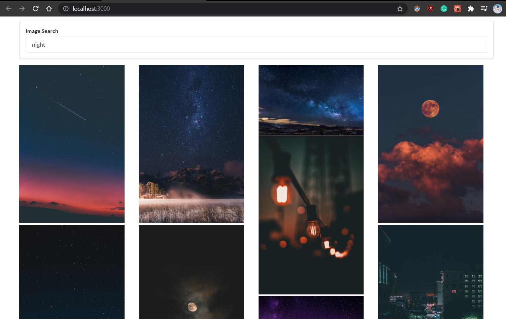

# Pics

- Fetch API from Unsplash with axios
- Handle user input
- Event handlers
- Controlled components
- Refs
- CSS grid system

Display the images based on the keyword from user input with Unsplash API

# Screenshots

